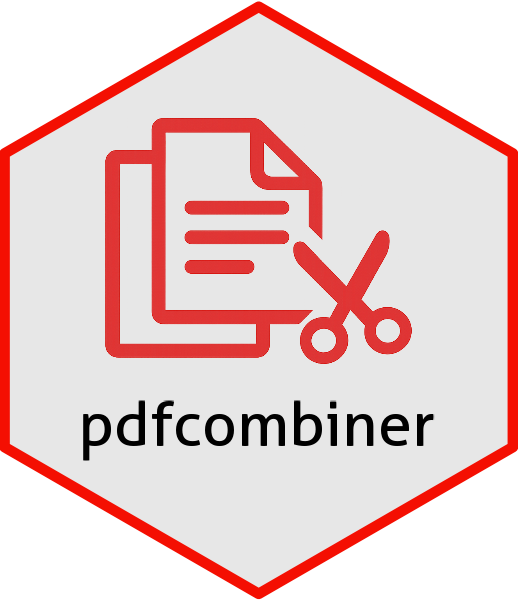

# PDF Combiner 

<!-- badges: start -->
[](https://github.com/stevechoy/pdfcombiner/actions/workflows/R-CMD-check.yaml)
<!-- badges: end -->

## Overview

PDF Combiner (`{pdfcombiner}`) is an R package that bundles a simple Shiny App for merging of pdf and/or image files with page selection, removal, or rotation options. The online demo version is available [here](https://lagom.shinyapps.io/pdfcombiner/).  

It is a **fast, free, and secure alternative** to commercial software such as Adobe Acrobat and/or various online websites which require users to sign-up, and it avoids any potential risks associated with uploading files elsewhere.    

Features include:  
- Supports multiple upload of PDFs or image files, either one at a time or all at once  
- Select PDFs to be combined and change the order of files  
- Select / remove pages by either using commas (1,2,3), hyphens (5-10), or a combination of both (1,2,3,5-10)  
- Rotate pages  
- Watermark stamp with custom text
- Built-in PDF viewer / editor to verify changes  
- Remove password-protection  
- Smart lossless PDF compression (i.e. always return the smallest file regardless of compression)
- Experimental feature of PDF conversion into Word, Excel, PowerPoint, or .png images  

PDF Combiner aims to fill a niche where R users with *restricted* permissions (i.e. corporate environment) could still have a **local option** to handle most of their PDF needs for free.

## Installation

You can install the latest development version from GitHub: 

``` r
## Install devtools first if required
# install.packages(devtools)

devtools::install_github("stevechoy/pdfcombiner")

## Pending CRAN submission
# install.packages(pdfcombiner)

```

For advanced users, you may run PDF Combiner locally *without* installing it as a package (i.e. launch the App directly from R console), as long as you have the following packages:  

``` r
install.packages(shiny)
install.packages(pdftools)

# install.packages(staplr)   # Recommended, retains bookmarks (may need separate Java installation)
# install.packages(magick)   # Recommended, allows image files to be uploaded
# install.packages(officer)  # Optional, only used for PDF conversion to Word / Powerpoint
# install.packages(openxlsx) # Optional, only used for PDF conversion to Excel

shiny::runGitHub("stevechoy/pdfcombiner", subdir = "inst/shiny", launch.browser = TRUE)

## Or you can copy directly from https://github.com/stevechoy/pdfcombiner/blob/main/inst/shiny/app.R
```

### Installing Java

The `{staplr}` [package](https://github.com/pridiltal/staplr/) is **highly recommended** as it supports bookmarks, however it uses Java so you may need to install Java separately if your system does not currently have it (instructions are included on the `{staplr}` page). Tip: Choose the 64-bit version if your R installation is also 64-bit.  

After installation, you are recommended to restart your R instance before proceeding.  

## Running the App

``` r
library(pdfcombiner)
pdfcombiner()

## see ?pdfcombiner() for a list of options
# pdfcombiner(bootstrap_theme = FALSE) # Turning off bootstrap theme for older versions of shiny
```

Instructions are included on the left hand side of the page.


## Notes

- By default the modern Bootstrap UI theme is used (from the `{bslib}` [package](https://github.com/rstudio/bslib)), which allows minimizing of the sidebar. You can turn off this option by setting `bootstrap_theme = FALSE` during App launch.  
- To retain bookmarks after combining PDFs, you need to install the `{staplr}` [package](https://github.com/pridiltal/staplr/). Importantly, bookmarks *cannot* be retained when any pages are selected, removed, or rotated (or when passwords are removed).  
- If you want to install a free graphical tool, you can check out [PDFtk](https://www.pdflabs.com/tools/pdftk-the-pdf-toolkit/) (Windows only), which is the back-end for the `{staplr}` package.  
- All PDF files are stored locally in a per-session temporary directory, given by the `tempdir()` function.  

## Known Issues

- Hyperlinks may not correctly cross-link if you don't have the `{staplr}` package.  
- Each original PDF file name must be different from each other.  
