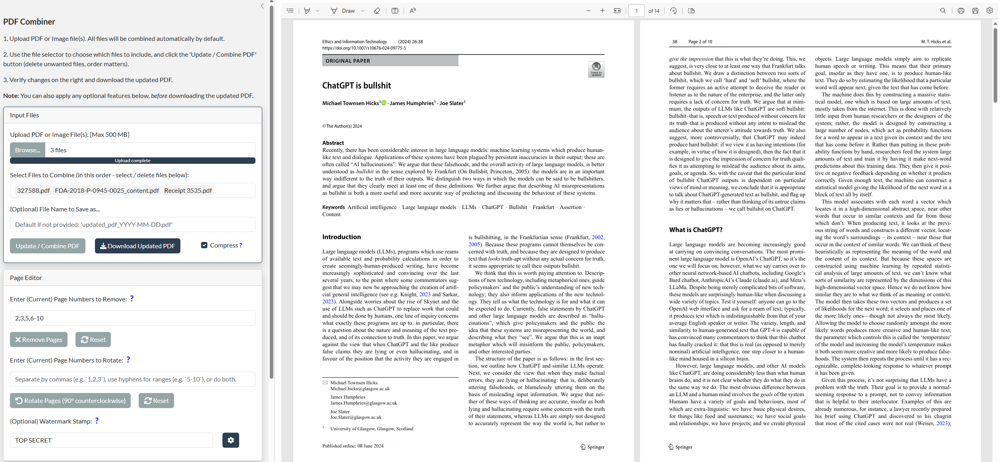

# PDF Combiner

PDF Combiner is a simple <a href="https://lagom.shinyapps.io/PDF_Combiner/" target="_blank">R Shiny App</a> that allows merging of pdf and/or image files with page removal and page rotation options.  

It is a **fast, free, and secure alternative** to commercial software such as Adobe Acrobat and/or various online websites which require users to sign-up, and it avoids any potential risks associated with uploading files elsewhere.    

Features include:  
- Supports multiple upload of PDFs or image files, either one at a time or all at once  
- Select PDFs to be combined and change the order of files  
- Remove pages by either using commas (1,2,3), hyphens (5-10), or a combination of both (1,2,3,5-10)  
- Rotate pages  
- Built-in PDF viewer / editor to verify changes  
- Remove password-protection  
- Lossless PDF compression  
- Experimental feature of PDF conversion into Word, Excel, PowerPoint, or .png images  

## Pre-requisites

To run PDF Combiner locally, you may need to install a few R packages:

``` r
install.packages(shiny)
install.packages(pdftools)

# install.packages(staplr)   # Recommended, retains bookmarks (may need separate Java installation)
# install.packages(magick)   # Recommended, allows image files to be uploaded
# install.packages(officer)  # Optional, only used for PDF conversion to Word / Powerpoint
# install.packages(openxlsx) # Optional, only used for PDF conversion to Excel
```

### Installing Java

The `{staplr}` package is **highly recommended** as it supports bookmarks, however it uses Java so you may need to <a href="https://www.java.com/en/download/" target="_blank">install Java separately</a> if your system does not currently have it. Choose the 64-bit version if your R installation is also 64-bit.  

After installation, you are recommended to restart your R instance before proceeding.  


## Running the App

Simply save the <a href="https://github.com/stevechoy/PDF_Combiner/blob/main/app.R" target="_blank">app.R</a> file locally and run the App in R.  

Alternatively, you may launch the App *directly* from R console (assuming you have the required packages listed above):

``` r
shiny::runGitHub("PDF_Combiner", username = "stevechoy", launch.browser = TRUE)
```
Instructions are included on the left hand side of the page.



## Notes

- By default the modern Bootstrap UI theme is used (`{bslib}` package), which allows minimizing of the sidebar. You can turn off this option by setting `bootstrap_theme <- FALSE` in the app.R file.  
- To retain bookmarks after combining PDFs, you need to install the `{staplr}` <a href="https://github.com/pridiltal/staplr/" target="_blank">package</a>. Importantly, bookmarks *cannot* be retained when any pages are removed or rotated (or when passwords are removed).  
- If you want to install a free graphical tool, you can check out <a href="https://www.pdflabs.com/tools/pdftk-the-pdf-toolkit/" target="_blank">PDFtk</a> (Windows only), which is the back-end for the `{staplr}` package.  
- All PDF files are stored locally in a per-session temporary directory, given by the `tempdir()` function.  

## Known Issues

- Hyperlinks may not correctly cross-link if you don't have the `{staplr}` package.  
- Each original PDF file name must be different from each other.  
